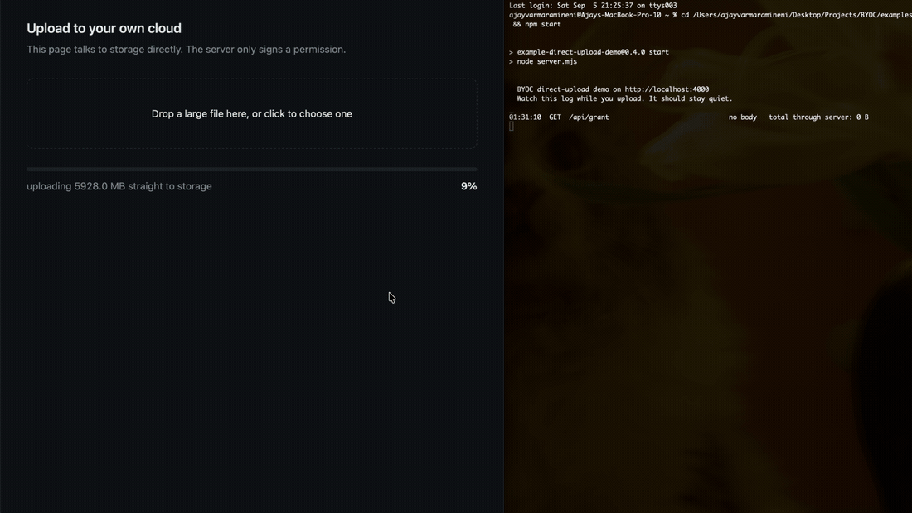

<div align="center">


# BYOC: Bring Your Own Cloud

### One API for storage your users already own.

<p>Google Drive, S3 and R2, Nextcloud, or a local disk. The bytes go from your user's browser straight to your user's cloud &mdash; your server never touches them.</p>

[](https://github.com/Ajayvarmaramineni/BYOC/actions)
[](https://www.npmjs.com/package/@byoc/core)
[](https://pypi.org/project/byoc-storage/)
[](#testing-and-verification)
[](#testing-and-verification)
[](LICENSE)

<br />



<p><em>A 5.9&nbsp;GB file, uploaded in 7.9 seconds. The application server's log &mdash; on the right &mdash;<br />records two requests and <strong>zero bytes</strong>. <a href="./examples/direct-upload-demo">Run it yourself</a>.</em></p>

</div>

---

## What is BYOC?

Every application that handles user files pays the same three costs: a storage bill that grows with your user count rather than your revenue, legal exposure for data you never wanted, and a trust problem now that users ask whether their files train someone's model.

BYOC's answer to all three is the same: **don't hold the data.** Read and write storage the end user *already owns* — their Google Drive, their company Nextcloud, their own S3 bucket. One API, any supported backend, TypeScript or Python.

The word doing the work is **already**. This asks nothing of your users beyond an account they have: no new protocol, no new server, no migration.

### Your server issues a permission, not a pipe

```text
   WITHOUT BYOC                          WITH BYOC

   browser                               browser
      │                                     │
      ▼                                     │  short-lived grant
   your server   ← bandwidth                ▼
      │          ← liability            user's cloud
      ▼          ← storage bill
   your S3                              your server: metadata only
```

Your server signs a short-lived, path-scoped credential and records a pointer. It never sees a byte of content. That is not a diagram of an intention — it is what [`@byoc/browser`](./packages/browser) does today, and the S3 signature covers the object key, so a client holding a grant for one path cannot redirect it to another.

```text
                        YOUR APPLICATION
                               │
                    ┌──────────┴──────────┐
                    │        BYOC         │
                    │  Universal Storage  │
                    └──────────┬──────────┘
                               │
        ┌──────────────────────┼──────────────────────┐
        ▼                      ▼                      ▼
  PERSONAL CLOUD          SELF-HOSTED           DEVELOPER CLOUD
  Google Drive            Nextcloud             Cloudflare R2
  OneDrive (planned)      ownCloud              AWS S3
  Dropbox (planned)       Synology NAS          MinIO / Wasabi
```

The application talks to BYOC. BYOC handles OAuth and PKCE, token refresh, virtual path resolution, resumable chunked uploads, rate-limit retries, and the differences between providers.

---

## Install

BYOC ships two peer SDKs with the same capabilities. Pick your language, or use both.

<table>
<tr><th>TypeScript</th><th>Python</th></tr>
<tr valign="top">
<td>

```bash
npm install @byoc/core

npm install @byoc/browser

npm install @byoc/local
npm install @byoc/memory
npm install @byoc/google-drive
npm install @byoc/s3-compatible
npm install @byoc/webdav
```

</td>
<td>

```bash
pip install byoc-storage
```

All adapters are included.

</td>
</tr>
</table>

> The Python distribution is named `byoc-storage` because `byoc` on PyPI belongs to an unrelated project. The import name is still `byoc`.

---

## Quick start

No account, no network, no credentials. The local and in-memory adapters are a
one-line install on npm and are bundled in the Python package, so you can run
BYOC before deciding whether you want it.

<table>
<tr><th>TypeScript</th><th>Python</th></tr>
<tr valign="top">
<td>

```ts
import { BYOC } from "@byoc/core";
import { LocalFileSystemProvider }
  from "@byoc/local";

const storage = new BYOC({
  provider: new LocalFileSystemProvider({
    rootDirectory: "./storage"
  })
});

await storage.connect();
await storage.writeText("hello.md", "# Hi");

console.log(
  await storage.readText("hello.md")
);
```

</td>
<td>

```python
from byoc import (
    AsyncBYOC,
    LocalFileSystemProvider,
)

storage = AsyncBYOC(
    provider=LocalFileSystemProvider(
        "./storage"
    )
)

async with storage:
    await storage.write_text(
        "hello.md", "# Hi"
    )
    print(
        await storage.read_text("hello.md")
    )
```

</td>
</tr>
</table>

Swap `LocalFileSystemProvider` for `S3CompatibleProvider`, `WebDAVProvider`, or
`GoogleDriveProvider` and none of the calling code changes. That substitution is
the entire point of BYOC, and it is the first thing you can check for yourself.

### Against a real provider

<table>
<tr><th>TypeScript</th><th>Python</th></tr>
<tr valign="top">
<td>

```ts
import { BYOC } from "@byoc/core";
import { S3CompatibleProvider }
  from "@byoc/s3-compatible";

const storage = new BYOC({
  provider: new S3CompatibleProvider({
    endpoint: process.env.R2_ENDPOINT!,
    bucket: "user-assets",
    region: "auto",
    accessKeyId: process.env.R2_KEY!,
    secretAccessKey: process.env.R2_SECRET!
  })
});

await storage.connect();

await storage.writeText(
  "documents/welcome.md",
  "# Hello from BYOC!"
);

const text = await storage.readText(
  "documents/welcome.md"
);
```

</td>
<td>

```python
import os
from byoc import AsyncBYOC
from byoc.providers.s3 import (
    S3CompatibleProvider,
)

storage = AsyncBYOC(
    provider=S3CompatibleProvider(
        endpoint=os.environ["R2_ENDPOINT"],
        bucket="user-assets",
        region="auto",
        access_key_id=os.environ["R2_KEY"],
        secret_access_key=os.environ["R2_SECRET"],
    )
)

async with storage:
    await storage.write_text(
        "documents/welcome.md",
        "# Hello from BYOC!",
    )
    text = await storage.read_text(
        "documents/welcome.md"
    )
```

</td>
</tr>
</table>

The Python SDK is idiomatic Python, not a transliteration: `snake_case`, exceptions you catch by type, `asyncio` throughout, dataclasses rather than a forced Pydantic dependency.

**Google Drive** needs an OAuth client first. The [setup guide](./docs/google-oauth-setup.md) takes about 10 minutes and covers the three places the Google Cloud console fails silently.

---

## Upload straight to the user's cloud

Your server mints a grant. The browser uses it. No file bytes cross your
infrastructure.

**On your server** — an API route that checks the caller may write there, then
signs:

```ts
const grant = await storage.createUploadGrant(`users/${userId}/${filename}`, {
  expiresInSeconds: 900
});
return Response.json(grant);
```

**In the browser:**

```ts
import { uploadWithGrant, reviveGrant } from "@byoc/browser";

const grant = reviveGrant(await fetch("/api/upload-grant?...").then(r => r.json()));

await uploadWithGrant(grant, file, {
  onProgress: p => setPercent(p.percentage)
});
```

The grant is plain JSON with no credential of yours in it. Two providers reach
that shape by different routes: S3 signs a `PUT` covering `UNSIGNED-PAYLOAD` and
the `host` header only, and Google Drive opens a resumable session whose URI is
itself the capability and needs no `Authorization` header — so your OAuth token
stays on your server.

It is a bearer capability, so keep the lifetime short and only issue one after
checking the caller is allowed to write to that path. The signature covers the
object key, so a client cannot redirect a grant to a different file.

> Providers report this through the `directUpload` capability. WebDAV returns
> `false` — it authenticates every request with Basic credentials, so there is
> no URL a browser can be handed without also handing it the password.

**[Run it yourself](./examples/direct-upload-demo)** — a page, a 90-line server,
and a request log that stays at zero bytes while the file uploads. Points at a
local MinIO by default, so it needs no cloud account.

---

## Files larger than memory

Every adapter accepts an async iterator and transfers it without buffering the
object. Measured against a live server, uploading a file from disk:

```
                    100 MB file    400 MB file    800 MB file
streamed              57.9 MB        56.7 MB        57.0 MB
buffered                  —         446.2 MB           —
```

Flat, regardless of size. A file larger than available memory went from
impossible to unremarkable.

```python
async def chunks():
    with open("lecture.mp4", "rb") as fh:
        while block := fh.read(1024 * 1024):
            yield block

await storage.upload("recordings/lecture.mp4", chunks())
```

Each provider needs a different mechanism, and BYOC picks the right one: S3
answers `411 Length Required` to a chunked `PUT`, so an unknown-length body
becomes a multipart upload; WebDAV takes chunked transfer-encoding directly;
Google Drive needs a resumable session with a one-chunk lookahead, because it
accepts `bytes 0-N/*` while the total is unknown but demands the real total on
the final chunk.

Downloads stream as well, so `StorageOutput.stream()` yields chunks rather than
buffering the object first. That is what makes a migration bounded by the chunk
size rather than by the largest file in it: a 300 MB transfer between providers
holds 56 MB, in either direction.

Encryption streams too. `BYOC_E2EE_V3` authenticates independent frames, binding
the header, frame index and a final-frame marker as additional authenticated
data, so reordering, truncation and header swaps are all detected — and a large
file can be encrypted without holding it.

---

## How this differs from what you might compare it to

**vs. an S3 SDK.** S3 puts files in *your* bucket. The bill and the breach are
yours. BYOC puts them in the user's account, on the user's quota.

**vs. Uppy / Companion.** Uppy is an importer: a user picks a file from their
Drive and it is copied into your storage. After the import you hold the file and
all three costs apply. With BYOC it never leaves.

**vs. Solid / remoteStorage.** Same goal, opposite method. They define a new
protocol and need new servers and new user habits. BYOC uses accounts users
already have.

**vs. OpenDAL / rclone.** Both are excellent tools you reach for. BYOC is a
dependency your application ships with, and it makes provider differences
explicit rather than flattening them — you feature-detect `directUpload` instead
of discovering at runtime that a provider cannot do it.

> **"Isn't this just presigned URLs?"**
>
> For S3, yes — about ten lines. Now do Google Drive's resumable sessions,
> progress and resume in the browser, and swap providers without touching your
> code.

---

## Supported providers

| Provider | Ownership model | TypeScript | Python | Status |
| :--- | :--- | :--- | :--- | :--- |
| **Local filesystem** | Local disk / mounted volume | [`@byoc/local`](./packages/local) | `byoc.LocalFileSystemProvider` | Live-verified |
| **In-memory** | Test double | [`@byoc/memory`](./packages/memory) | `byoc.MemoryProvider` | Live-verified |
| **Google Drive** | Personal cloud | [`@byoc/google-drive`](./packages/google-drive) | `byoc.providers.gdrive` | Live-verified |
| **Cloudflare R2 / AWS S3 / MinIO / Wasabi** | Developer cloud | [`@byoc/s3-compatible`](./packages/s3-compatible) | `byoc.providers.s3` | Live-verified |
| **Nextcloud / ownCloud / WebDAV / Synology** | Self-hosted | [`@byoc/webdav`](./packages/webdav) | `byoc.providers.webdav` | Live-verified |
| **Browser direct upload** | Client-side transfer | [`@byoc/browser`](./packages/browser) | n/a — browser only | Live-verified |
| **Provider Certification SDK** | Compliance harness | [`@byoc/provider-sdk`](./packages/provider-sdk) | planned | Stable |
| Microsoft OneDrive | Personal cloud | planned | planned | Planned |
| Dropbox | Personal cloud | planned | planned | Planned |

*Live-verified* means the adapter is exercised against a real server, not a mock. See [Testing and verification](#testing-and-verification).

Not every provider can do everything, and BYOC says so rather than failing at the call site:

| | Streams | Direct browser upload | Real folders | Server-side copy |
| :--- | :---: | :---: | :---: | :---: |
| Google Drive | yes | yes | yes | yes |
| S3 / R2 / MinIO | yes | yes | no | yes |
| Nextcloud / WebDAV | yes | **no** | yes | yes |
| Local filesystem | yes | **no** | yes | yes |
| In-memory | yes | **no** | no | yes |

WebDAV cannot issue a browser grant because it authenticates every request with Basic credentials; local and in-memory are not reachable over HTTP. Feature-detect with `hasCapability("directUpload")`.

---

## Cross-SDK compatibility

Both SDKs are peer implementations of one contract. They run against the same conformance vectors in [`spec/fixtures`](./spec), and an automated interop suite drives both against the same live servers on every push.

A file written by a Next.js frontend is readable by a FastAPI backend, and the reverse.

| Surface | Guarantee |
| :--- | :--- |
| Virtual paths | Identical normalization and RFC 3986 encoding |
| Object keys | `#`, `?`, spaces, apostrophes, and unicode round-trip in both |
| E2EE envelope | Byte-identical layout at any valid PBKDF2 iteration count |
| Provider metadata | `byocVirtualPath` stays camelCase in both languages |
| AWS SigV4 | Signatures match a clean-room reference implementation |
| PKCE | Verified against RFC 7636 Appendix B |

This matters because those surfaces write to **shared external state**. Everything else, including method names and error class hierarchies, is idiomatic per language and deliberately not specified.

---

## What BYOC is, and what it isn't

> **Use PostgreSQL for application data. Use the user's own cloud for their files.**

BYOC is a binary blob and file-storage abstraction. It is not a database replacement.

| Use PostgreSQL / SQLite / MySQL for | Use BYOC for |
| :--- | :--- |
| Users, logins, and sessions | Documents (PDF, DOCX, spreadsheets) |
| Relational data and foreign keys | Media (images, audio, 4K video) |
| ACID transactions and fast lookups | Large attachments and exports |
| Queries (`WHERE`, `JOIN`, `GROUP BY`) | Database backups (`.sql.gz`, `app.sqlite`) |

```text
FastAPI / Django / Next.js / Express
   │
   ├── PostgreSQL  →  users, subscriptions, permissions, metadata pointers
   │
   └── BYOC        →  the actual PDFs, photos, videos, model artifacts
           │
           ├── Google Drive   (User A's personal storage)
           ├── Nextcloud      (User B's self-hosted storage)
           └── Cloudflare R2  (User C's infrastructure bucket)
```

---

## Capabilities

**Storage**
- One API across personal clouds, self-hosted servers, and developer object storage
- Virtual POSIX paths (`users/123/report.pdf`) resolved to each provider's native addressing, including Google Drive's opaque file IDs
- Multi-provider registry with runtime switching, and stream-piped migration between any two providers
- Paginated listing that follows continuation tokens past provider page caps
- Recursive `walk()` and `delete_tree()`, and a concurrent `delete_many()` that reports per-path outcomes instead of failing the batch
- Server-side `copy()` and `move()` on every adapter, so the bytes never travel through your process

**Uploads**
- Resumable chunked uploads with 256 KiB alignment, progress callbacks, and network-failure resumption
- Automatic MIME detection, with per-upload overrides
- Signed URLs for S3-compatible backends, so a browser can fetch without proxying bytes through you

**Security**
- OAuth 2.0 with PKCE (RFC 7636) and CSRF state, using the non-restricted `drive.file` scope so you never enter Google's Restricted Scope assessment
- Framed client-side E2EE with bounded-memory stream APIs, per-frame AES-256-GCM authentication, and V1/V2 read compatibility
- Encrypted-at-rest token storage, written with owner-only permissions
- Credential redaction in logs, covering bearer tokens, refresh tokens, and cloud access keys
- Path traversal rejection and control-character stripping on every virtual path

**Reliability**
- Exponential backoff with jitter, applied only to errors the provider marked retryable
- 404 self-healing: when a user renames or deletes a file outside the application, the stale cache entry is dropped and the path re-resolved
- Provider-neutral error taxonomy shared across both SDKs

---

## Testing and verification

```
TypeScript   416 tests      tsc --strict
Python       452 tests      mypy --strict, ruff
Integration   43 tests      live MinIO and WebDAV servers
Interop       14 tests      both SDKs, same live servers
```

Every adapter is exercised against a real server rather than a mock. Each of the following was a genuine bug caught that way and invisible to mocked tests:

- Object keys containing `#` or `?` were silently truncated, so `draft#2.pdf` and `draft#3.pdf` overwrote each other
- SigV4 signatures were rejected when a caller passed a canonically-cased header
- Google Drive queries broke on any filename containing an apostrophe
- S3 server-side copy truncated the copy source at a `#`, so `copy("draft#2.pdf", ...)` reported the object missing

<table>
<tr><th>TypeScript</th><th>Python</th></tr>
<tr valign="top">
<td>

```bash
npm test
npm run typecheck
npm run build
```

</td>
<td>

```bash
cd python
pip install -e ".[dev]"
pytest
mypy src && ruff check .
```

</td>
</tr>
</table>

**Live integration.** Integration and interop suites skip automatically when no server is reachable, so the default run stays offline. To exercise them:

```bash
brew install minio && minio server /tmp/byoc-minio-data --address :9000
```

The WebDAV suite starts its own in-process RFC 4918 server and needs no setup. CI runs both against real servers on every push, and fails the build if either suite self-skips.

**Google Drive** cannot run in CI, since it requires a real account and a browser consent step. Validate it manually:

```bash
cd python && .venv/bin/python scripts/validate_gdrive_live.py
```

---

## Repository layout

```text
byoc/
├── packages/                   # TypeScript SDK, published to npm
│   ├── core/                   # universal client, paths, migration, E2EE, logging
│   ├── google-drive/           # OAuth PKCE, virtual paths, resumable uploads
│   ├── s3-compatible/          # SigV4 signer, R2 / S3 / MinIO client
│   ├── webdav/                 # Nextcloud, ownCloud, Synology adapter
│   ├── local/                  # local filesystem, no credentials required
│   ├── memory/                 # in-memory test double
│   └── provider-sdk/           # certification harness for custom adapters
├── python/                     # Python SDK, published to PyPI as byoc-storage
│   ├── src/byoc/               # client, paths, encryption, retry, providers/
│   ├── tests/                  # unit, conformance, integration, interop
│   └── scripts/                # live Google Drive validation
├── spec/fixtures/              # cross-SDK conformance vectors
├── docs/                       # setup and integration guides
├── scripts/                    # repeatable engineering benchmarks
└── examples/                   # runnable demonstrations
    ├── node-quickstart/        # TypeScript
    └── python-quickstart/      # Python
```

---

## Provider isolation

> **Google Drive is BYOC's first reference provider. Google Drive is not BYOC's architecture.**

Core stays provider-neutral. Provider-specific concepts, APIs, authentication mechanisms, proprietary IDs, and error quirks belong strictly inside adapters.

| Forbidden in core | Required in core |
| :--- | :--- |
| `driveFileId`, `s3ObjectKey`, `blobName` | `id`, `providerId` |
| `driveFolderId`, `s3Bucket`, `blobContainer` | `path`, `container` |
| `googleDriveAccessToken`, `awsAccessKey` | `Credential`, `AuthSession` |

Building your own adapter? [`@byoc/provider-sdk`](./packages/provider-sdk) runs a certification suite against it.

---

## Documentation

| Guide | Contents |
| :--- | :--- |
| [Google Drive OAuth setup](./docs/google-oauth-setup.md) | Cloud console walkthrough, troubleshooting, token persistence |
| [Conformance fixtures](./spec) | The cross-SDK contract and how to run it |
| [Internal roadmap](./docs/design/roadmap-internal.md) | Where BYOC is heading over several releases, and what we deliberately will not build |
| [Streaming and E2EE design](./docs/design/streaming-and-chunked-e2ee.md) | V3 wire format, security model, provider constraints and sequencing |
| [Python SDK](./python) | Install, async client, FastAPI and Celery notes |
| [Changelog](./CHANGELOG.md) | Release history and known limitations |
| [Contributing](./CONTRIBUTING.md) | Development setup for both SDKs, and the pull request process |
| [Code of Conduct](./CODE_OF_CONDUCT.md) | Community standards and enforcement |
| [Security policy](./SECURITY.md) | Reporting vulnerabilities, security architecture |

---

## License

[Apache License 2.0](LICENSE). Free for personal, educational, and commercial use.
