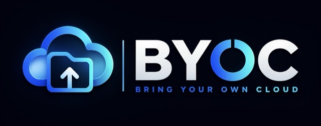

<div align="center">



# BYOC: Bring Your Own Cloud

### One API. The user's own cloud.

<p>One storage API for Google Drive, Nextcloud, and S3-compatible clouds, so files live in accounts the end user already owns.</p>

[](https://github.com/Ajayvarmaramineni/BYOC/actions)
[](https://www.npmjs.com/package/@byoc/core)
[](https://pypi.org/project/byoc-storage/)
[](#testing-and-verification)
[](#testing-and-verification)
[](LICENSE)

</div>

---

## What is BYOC?

Every application that handles user files eventually pays the same tax: a storage bucket that grows forever, an egress bill that scales with success, and a compliance conversation about data nobody wanted to hold.

BYOC removes it. Rather than the application hosting every file, it reads and writes storage **the end user already owns**: a personal Google Drive, a company Nextcloud, an organization's own S3 bucket. One API, any supported backend, in TypeScript or Python.

```text
                        YOUR APPLICATION
                               │
                    ┌──────────┴──────────┐
                    │        BYOC         │
                    │  Universal Storage  │
                    └──────────┬──────────┘
                               │
        ┌──────────────────────┼──────────────────────┐
        ▼                      ▼                      ▼
  PERSONAL CLOUD          SELF-HOSTED           DEVELOPER CLOUD
  Google Drive            Nextcloud             Cloudflare R2
  OneDrive (planned)      ownCloud              AWS S3
  Dropbox (planned)       Synology NAS          MinIO / Wasabi
```

The application talks to BYOC. BYOC handles OAuth and PKCE, token refresh, virtual path resolution, resumable chunked uploads, rate-limit retries, and the differences between providers.

---

## Install

BYOC ships two peer SDKs with the same capabilities. Pick your language, or use both.

<table>
<tr><th>TypeScript</th><th>Python</th></tr>
<tr valign="top">
<td>

```bash
npm install @byoc/core

npm install @byoc/google-drive
npm install @byoc/s3-compatible
npm install @byoc/webdav
```

</td>
<td>

```bash
pip install byoc-storage
```

All adapters are included.

</td>
</tr>
</table>

> The Python distribution is named `byoc-storage` because `byoc` on PyPI belongs to an unrelated project. The import name is still `byoc`.

---

## Quick start

<table>
<tr><th>TypeScript</th><th>Python</th></tr>
<tr valign="top">
<td>

```ts
import { BYOC } from "@byoc/core";
import { S3CompatibleProvider }
  from "@byoc/s3-compatible";

const storage = new BYOC({
  provider: new S3CompatibleProvider({
    endpoint: process.env.R2_ENDPOINT!,
    bucket: "user-assets",
    region: "auto",
    accessKeyId: process.env.R2_KEY!,
    secretAccessKey: process.env.R2_SECRET!
  })
});

await storage.connect();

await storage.writeText(
  "documents/welcome.md",
  "# Hello from BYOC!"
);

const text = await storage.readText(
  "documents/welcome.md"
);
```

</td>
<td>

```python
import os
from byoc import AsyncBYOC
from byoc.providers.s3 import (
    S3CompatibleProvider,
)

storage = AsyncBYOC(
    provider=S3CompatibleProvider(
        endpoint=os.environ["R2_ENDPOINT"],
        bucket="user-assets",
        region="auto",
        access_key_id=os.environ["R2_KEY"],
        secret_access_key=os.environ["R2_SECRET"],
    )
)

async with storage:
    await storage.write_text(
        "documents/welcome.md",
        "# Hello from BYOC!",
    )
    text = await storage.read_text(
        "documents/welcome.md"
    )
```

</td>
</tr>
</table>

The Python SDK is idiomatic Python, not a transliteration: `snake_case`, exceptions you catch by type, `asyncio` throughout, dataclasses rather than a forced Pydantic dependency.

**Google Drive** needs an OAuth client first. The [setup guide](./docs/google-oauth-setup.md) takes about 10 minutes and covers the three places the Google Cloud console fails silently.

---

## Supported providers

| Provider | Ownership model | TypeScript | Python | Status |
| :--- | :--- | :--- | :--- | :--- |
| **Google Drive** | Personal cloud | [`@byoc/google-drive`](./packages/google-drive) | `byoc.providers.gdrive` | Live-verified |
| **Cloudflare R2 / AWS S3 / MinIO / Wasabi** | Developer cloud | [`@byoc/s3-compatible`](./packages/s3-compatible) | `byoc.providers.s3` | Live-verified |
| **Nextcloud / ownCloud / WebDAV / Synology** | Self-hosted | [`@byoc/webdav`](./packages/webdav) | `byoc.providers.webdav` | Live-verified |
| **Provider Certification SDK** | Compliance harness | [`@byoc/provider-sdk`](./packages/provider-sdk) | planned | Stable |
| Microsoft OneDrive | Personal cloud | planned | planned | Planned |
| Dropbox | Personal cloud | planned | planned | Planned |

*Live-verified* means the adapter is exercised against a real server, not a mock. See [Testing and verification](#testing-and-verification).

---

## Cross-SDK compatibility

Both SDKs are peer implementations of one contract. They run against the same conformance vectors in [`spec/fixtures`](./spec), and an automated interop suite drives both against the same live servers on every push.

A file written by a Next.js frontend is readable by a FastAPI backend, and the reverse.

| Surface | Guarantee |
| :--- | :--- |
| Virtual paths | Identical normalization and RFC 3986 encoding |
| Object keys | `#`, `?`, spaces, apostrophes, and unicode round-trip in both |
| E2EE envelope | Byte-identical layout at any valid PBKDF2 iteration count |
| Provider metadata | `byocVirtualPath` stays camelCase in both languages |
| AWS SigV4 | Signatures match a clean-room reference implementation |
| PKCE | Verified against RFC 7636 Appendix B |

This matters because those surfaces write to **shared external state**. Everything else, including method names and error class hierarchies, is idiomatic per language and deliberately not specified.

---

## What BYOC is, and what it isn't

> **Use PostgreSQL for application data. Use the user's own cloud for their files.**

BYOC is a binary blob and file-storage abstraction. It is not a database replacement.

| Use PostgreSQL / SQLite / MySQL for | Use BYOC for |
| :--- | :--- |
| Users, logins, and sessions | Documents (PDF, DOCX, spreadsheets) |
| Relational data and foreign keys | Media (images, audio, 4K video) |
| ACID transactions and fast lookups | Large attachments and exports |
| Queries (`WHERE`, `JOIN`, `GROUP BY`) | Database backups (`.sql.gz`, `app.sqlite`) |

```text
FastAPI / Django / Next.js / Express
   │
   ├── PostgreSQL  →  users, subscriptions, permissions, metadata pointers
   │
   └── BYOC        →  the actual PDFs, photos, videos, model artifacts
           │
           ├── Google Drive   (User A's personal storage)
           ├── Nextcloud      (User B's self-hosted storage)
           └── Cloudflare R2  (User C's infrastructure bucket)
```

---

## Capabilities

**Storage**
- One API across personal clouds, self-hosted servers, and developer object storage
- Virtual POSIX paths (`users/123/report.pdf`) resolved to each provider's native addressing, including Google Drive's opaque file IDs
- Multi-provider registry with runtime switching, and stream-piped migration between any two providers
- Paginated listing that follows continuation tokens past provider page caps

**Uploads**
- Resumable chunked uploads with 256 KiB alignment, progress callbacks, and network-failure resumption
- Automatic MIME detection, with per-upload overrides
- Presigned URLs for S3-compatible backends, so a browser can fetch without proxying bytes through you

**Security**
- OAuth 2.0 with PKCE (RFC 7636) and CSRF state, using the non-restricted `drive.file` scope so you never enter Google's Restricted Scope assessment
- Client-side E2EE with AES-256-GCM and PBKDF2-HMAC-SHA256 at 600,000 iterations, with the work factor recorded in the envelope and range-checked before key derivation
- Encrypted-at-rest token storage, written with owner-only permissions
- Credential redaction in logs, covering bearer tokens, refresh tokens, and cloud access keys
- Path traversal rejection and control-character stripping on every virtual path

**Reliability**
- Exponential backoff with jitter, applied only to errors the provider marked retryable
- 404 self-healing: when a user renames or deletes a file outside the application, the stale cache entry is dropped and the path re-resolved
- Provider-neutral error taxonomy shared across both SDKs

---

## Testing and verification

```
TypeScript   193 tests      tsc --strict
Python       224 tests      mypy --strict, ruff
Interop       13 tests      both SDKs, same live servers
```

Every adapter is exercised against a real server rather than a mock. Each of the following was a genuine bug caught that way and invisible to mocked tests:

- Object keys containing `#` or `?` were silently truncated, so `draft#2.pdf` and `draft#3.pdf` overwrote each other
- SigV4 signatures were rejected when a caller passed a canonically-cased header
- Google Drive queries broke on any filename containing an apostrophe

<table>
<tr><th>TypeScript</th><th>Python</th></tr>
<tr valign="top">
<td>

```bash
npm test
npm run typecheck
npm run build
```

</td>
<td>

```bash
cd python
pip install -e ".[dev]"
pytest
mypy src && ruff check .
```

</td>
</tr>
</table>

**Live integration.** Integration and interop suites skip automatically when no server is reachable, so the default run stays offline. To exercise them:

```bash
brew install minio && minio server /tmp/byoc-minio-data --address :9000
```

The WebDAV suite starts its own in-process RFC 4918 server and needs no setup. CI runs both against real servers on every push, and fails the build if either suite self-skips.

**Google Drive** cannot run in CI, since it requires a real account and a browser consent step. Validate it manually:

```bash
cd python && .venv/bin/python scripts/validate_gdrive_live.py
```

---

## Repository layout

```text
byoc/
├── packages/                   # TypeScript SDK, published to npm
│   ├── core/                   # universal client, paths, migration, E2EE, logging
│   ├── google-drive/           # OAuth PKCE, virtual paths, resumable uploads
│   ├── s3-compatible/          # SigV4 signer, R2 / S3 / MinIO client
│   ├── webdav/                 # Nextcloud, ownCloud, Synology adapter
│   └── provider-sdk/           # certification harness for custom adapters
├── python/                     # Python SDK, published to PyPI as byoc-storage
│   ├── src/byoc/               # client, paths, encryption, retry, providers/
│   ├── tests/                  # unit, conformance, integration, interop
│   └── scripts/                # live Google Drive validation
├── spec/fixtures/              # cross-SDK conformance vectors
├── docs/                       # setup and integration guides
└── examples/                   # runnable demonstrations
    ├── node-quickstart/        # TypeScript
    └── python-quickstart/      # Python
```

---

## Provider isolation

> **Google Drive is BYOC's first reference provider. Google Drive is not BYOC's architecture.**

Core stays provider-neutral. Provider-specific concepts, APIs, authentication mechanisms, proprietary IDs, and error quirks belong strictly inside adapters.

| Forbidden in core | Required in core |
| :--- | :--- |
| `driveFileId`, `s3ObjectKey`, `blobName` | `id`, `providerId` |
| `driveFolderId`, `s3Bucket`, `blobContainer` | `path`, `container` |
| `googleDriveAccessToken`, `awsAccessKey` | `Credential`, `AuthSession` |

Building your own adapter? [`@byoc/provider-sdk`](./packages/provider-sdk) runs a certification suite against it.

---

## Documentation

| Guide | Contents |
| :--- | :--- |
| [Google Drive OAuth setup](./docs/google-oauth-setup.md) | Cloud console walkthrough, troubleshooting, token persistence |
| [Conformance fixtures](./spec) | The cross-SDK contract and how to run it |
| [Python SDK](./python) | Install, async client, FastAPI and Celery notes |
| [Changelog](./CHANGELOG.md) | Release history and known limitations |
| [Contributing](./CONTRIBUTING.md) | Development setup for both SDKs, and the pull request process |
| [Code of Conduct](./CODE_OF_CONDUCT.md) | Community standards and enforcement |
| [Security policy](./SECURITY.md) | Reporting vulnerabilities, security architecture |

---

## License

[Apache License 2.0](LICENSE). Free for personal, educational, and commercial use.
